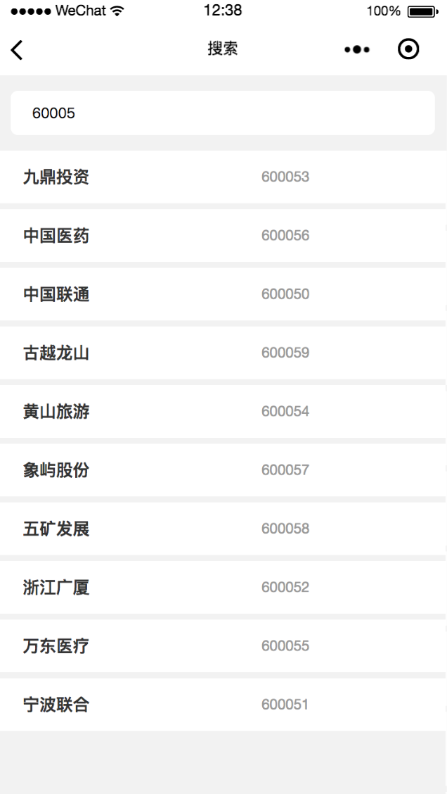

# mpstock

> 尝试用mpvue写小程序

数据源
[http://stockapi.apon.me/](http://stockapi.apon.me/)

使用到的库

```
"dependencies": {
    "echarts": "^4.0.4",
    "flyio": "^0.5.2",
    "mp-weui": "^1.0.0",
    "mpvue": "^1.0.8",
    "mpvue-echarts": "^0.2.2",
    "vuex": "^2.3.1"
  }
```

## 截图





## 基础安装

``` bash
# 克隆mpstock源码
git clone git@github.com:apon/mpstock.git

# 安装依赖
npm install

# 编译
npm run dev

# 启动微信开发者工具，打开项目即可预览
```


